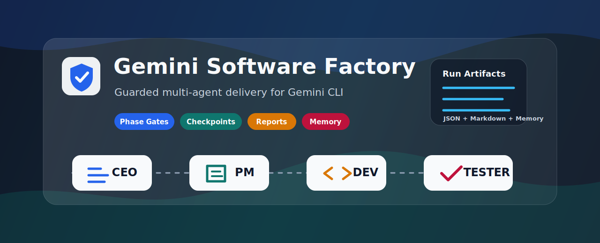

<p align="center">
  
</p>

<h1 align="center">Gemini Software Factory</h1>

<p align="center">
  A guarded multi-agent workflow extension for Gemini CLI that turns a software
  requirement into architecture, PRD, implementation, validation, reports, and
  reusable memory.
</p>

<p align="center">
  <a href="README.zh-CN.md"></a>
  
  
  
</p>

## Why It Exists

Coding agents are fast, but serious software work needs a trail: who planned
the change, what was accepted, what was tested, and what should be remembered.
Software Factory adds a small state machine around Gemini CLI so every run is
guarded, inspectable, and recoverable.

## Highlights

| Capability | What You Get |
| --- | --- |
|  | CEO, PM, Dev, and Tester run only in the approved order. |
|  | Every phase must return a machine-readable checkpoint before advancing. |
|  | Architecture, PRD, implementation summary, test report, and final report are written under `.agents/outputs/`. |
|  | Tester can send work back to Dev with root-cause guidance, while retry limits prevent endless loops. |
|  | Useful lessons can be preserved in `.agents/logs/evolution.jsonl`. |

## Workflow At A Glance

```text
Requirement -> CEO -> PM -> Dev -> Tester -> Report
                      ^              |
                      | retry        |
                      +--------------+
```

## Project Structure

```text
agents/                 Agent instructions for CEO, PM, Dev, and Tester
commands/               Gemini CLI slash commands
hooks/                  Workflow state, phase gate, and checkpoint hooks
gemini-extension.json   Extension manifest
GEMINI.md               Dispatcher instructions
PROJECT_PLAN.md         Productization and roadmap checklist
```

## Requirements

- Gemini CLI with extension support
- Node.js available on your PATH

The extension hooks are plain Node.js scripts and do not require npm
dependencies.

## Install

Install directly from GitHub:

```powershell
gemini extensions install https://github.com/hahaBlizzard/gemini-software-factory
```

Restart Gemini CLI after installation so the extension commands and hooks are
loaded.

You can verify the extension from your terminal:

```powershell
gemini extensions list
```

Or from inside Gemini CLI:

```text
/extensions list
```

## Local Development

If you want to develop or test local changes, clone the repository and link the
extension folder:

```powershell
git clone https://github.com/hahaBlizzard/gemini-software-factory.git
cd gemini-software-factory
gemini extensions link .
```

Linking points Gemini CLI at your local checkout, so you do not need to run an
extension update after every local edit. Restart Gemini CLI after linking.

## First Run

In each workspace where you want to use the factory, initialize the local
working directories and workflow state first:

```text
/factory-init
```

Then start a guarded workflow:

```text
/factory-run Build a small CLI tool that validates JSON files.
```

Review the returned checkpoint. When you are ready to continue:

```text
/factory-continue
```

Repeat `/factory-continue` as each phase completes. After Dev finishes
successfully, Tester validation may run automatically. If Tester asks for a
retry, the workflow pauses for human review before returning to Dev.

For a shorter path, use:

```text
/factory-lite Build a small CLI tool that validates JSON files.
```

## Demo Transcript

```text
> /factory-init
Initialization complete. Use /factory-run <requirement> to start the software factory.

> /factory-run Build a small CLI tool that validates JSON files.
{"current_phase":"ceo","status":"WAITING_FOR_USER_APPROVAL","checkpoint":"CEO_BLUEPRINT_READY","next_command":"/factory-continue","message":"CEO blueprint and architecture snapshot are ready."}

> /factory-continue
{"current_phase":"pm","status":"WAITING_FOR_USER_APPROVAL","checkpoint":"PM_PRD_READY","next_command":"/factory-continue","message":"PRD and acceptance criteria are ready."}

> /factory-continue
{"current_phase":"dev","status":"WAITING_FOR_USER_APPROVAL","checkpoint":"DEV_IMPLEMENTATION_COMPLETED","next_command":"auto:tester","message":"Implementation summary is ready; Tester will validate automatically."}

> auto handoff
{"current_phase":"tester","status":"FACTORY_WORKFLOW_COMPLETED","checkpoint":"TESTER_PASS","result":"PASS","message":"Tester accepted the implementation."}

> /factory-report
Report written to .agents/outputs/factory_report.md.
```

If Tester returns `RETRY_REQUIRED`, review `.agents/outputs/test_report.md`
and run `/factory-continue` only after you are ready to send the task back to
Dev.

## Workflow

The default workflow is:

```text
CEO -> PM -> Dev -> Tester
```

Each agent must return a valid JSON checkpoint. Hooks inject the current
workflow context, block invalid phase transitions, and validate checkpoint
output after each agent run.

Each phase also writes a Markdown artifact under `.agents/outputs/`:

- `architecture_snapshot.md`
- `prd.md`
- `implementation_summary.md`
- `test_report.md`
- `factory_report.md`

## Encoding Note

Repository prompts, commands, and documentation are UTF-8. If Chinese text in
PowerShell appears as mojibake, it is usually terminal decoding rather than file
corruption; the files should decode without `U+FFFD` replacement characters.

## Roadmap

See `PROJECT_PLAN.md` for the current productization plan and future work,
including status/reset/doctor commands, human-readable run artifacts, stronger
guardrails, memory tooling, and automated hook tests.

## License

MIT License. See `LICENSE`.
